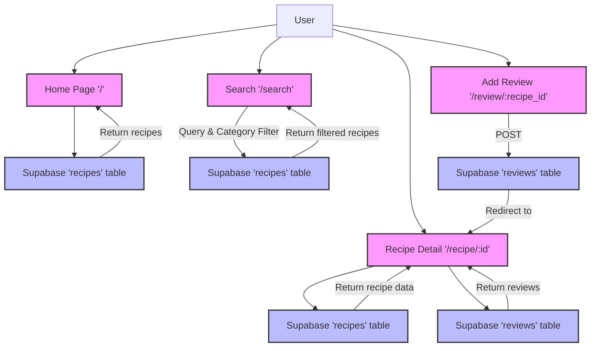

# Recipe Manager

A web application for managing and sharing cooking recipes built with Flask and Supabase. This application provides a user-friendly interface for browsing, searching, and reviewing recipes.

## Features

- Browse recipes with detailed information including ingredients and instructions
- Search recipes by ingredients or categories
- Leave reviews and ratings on recipes
- Modern, responsive UI with Bootstrap 5
- Supabase integration for reliable data storage
- Real-time recipe ratings and reviews

## Technology Stack

- **Backend**: Python Flask
- **Database**: Supabase
- **Frontend**: HTML, Bootstrap 5
- **Authentication**: Supabase Auth
- **Environment Management**: python-dotenv

## Prerequisites

- Python 3.x
- Supabase account
- Git (for version control)

## Installation

1. Clone the repository:
   ```bash
   git clone <repository-url>
   cd recipe-manager
   ```

2. Create and activate a virtual environment:
   ```bash
   python3 -m venv venv
   source venv/bin/activate  # On Windows: venv\Scripts\activate
   ```

3. Install dependencies:
   ```bash
   pip install -r requirements.txt
   ```

## Configuration

1. Set up Supabase:
   - Create a new project on [Supabase](https://supabase.com)
   - Set up the required database tables (see Database Schema section)

2. Environment Variables:
   Create a `.env` file in the project root with the following variables:
   ```
   FLASK_SECRET_KEY=your-secret-key
   SUPABASE_URL=your-supabase-project-url
   SUPABASE_KEY=your-supabase-anon-key
   ```

## Database Schema

### recipes
| Column         | Type          | Description                    |
|----------------|---------------|--------------------------------|
| id             | int          | Primary key                    |
| title          | string       | Recipe title                   |
| description    | text         | Recipe description             |
| ingredients    | json         | Array of ingredients           |
| instructions   | json         | Array of cooking steps         |
| cooking_time   | int          | Cooking time in minutes        |
| category       | string       | Recipe category               |
| image_url      | string       | URL to recipe image (optional) |
| average_rating | float        | Average user rating           |

### reviews
| Column      | Type      | Description                    |
|-------------|-----------|--------------------------------|
| id          | int       | Primary key                    |
| recipe_id   | int       | Foreign key to recipes.id      |
| rating      | int       | Rating (1-5)                   |
| comment     | text      | Review comment                 |
| created_at  | timestamp | Review creation timestamp      |

## API Routes

| Route                    | Method | Description                      |
|-------------------------|--------|----------------------------------|
| /                       | GET    | Home page with recipe list       |
| /recipe/<recipe_id>     | GET    | Detailed view of a recipe        |
| /search                 | GET    | Search recipes by query/category |
| /review/<recipe_id>     | POST   | Add a review to a recipe        |

## Running the Application

1. Start the Flask server:
   ```bash
   python app.py
   ```

2. Access the application at `http://localhost:5000`

## Project Structure

```
recipe-manager/
├── app.py              # Main Flask application
├── requirements.txt    # Python dependencies
├── .env               # Environment variables
├── schema.sql         # Database schema
├── templates/         # HTML templates
│   ├── base.html     # Base template
│   ├── index.html    # Home page
│   ├── recipe_detail.html    # Recipe detail page
│   └── search_results.html   # Search results page
└── README.md          # Project documentation
```

## Contributing

1. Fork the repository
2. Create a feature branch (`git checkout -b feature/AmazingFeature`)
3. Commit your changes (`git commit -m 'Add some AmazingFeature'`)
4. Push to the branch (`git push origin feature/AmazingFeature`)
5. Open a Pull Request

## License

This project is licensed under the MIT License - see the LICENSE file for details.

## Acknowledgments

- Flask framework
- Supabase for database services
- Bootstrap for UI components

